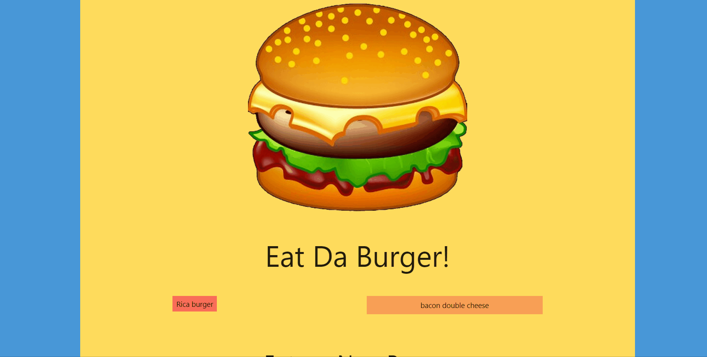

# Express-Handlebars-Burger 🍔

Thisapp stores user inputs as data in a Mysql database and display it through routes with express and uses handlebars as a template for the HTML that the user interacts with.

* Here is a link to the site(https://burger-app-jrss.herokuapp.com/) 

## How to Use

* On the left side we have the burgers that haven't been eaten.
* On the right side we have the burgers that have been eaten.
* On the button there is a form where you can add a new burger.
* Whenever you add a new burger it will display on the left side.
* If you click on one of the burgers on the left it means that you eat it.
* Then the burger that you ate displays on the right side.

Here is a little demo of the app:

## Technologies used:

* Node.js  

  

* Javascript  

  

* MySQL  

  

* Heroku  

  

* Express  

  

* Handlebars  

  

## npm packages: 
* [mysql](https://www.npmjs.com/package/mysql) - This is a node.js driver for mysql. It is written in JavaScript, does not require compiling, and is 100% MIT licensed.
* [Express](https://www.npmjs.com/package/express) - Express is a minimal and flexible Node.js web application framework that provides a robust set of features for web and mobile applications.
* [Express-handlebars](https://www.npmjs.com/package/express-handlebars) - This is a handlebars view engine for express.

## Author
* **Jesus Salazar** 

* [LinkedIn](https://www.linkedin.com/in/jesus-salazar-484837173/)
* [Github](https://github.com/jslzr27)
* [Portfolio](https://jslzr27.github.io/Responsive-Portfolio/)